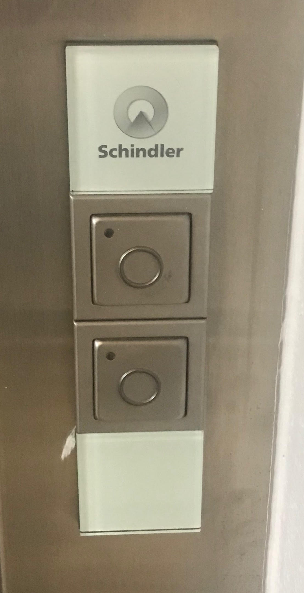
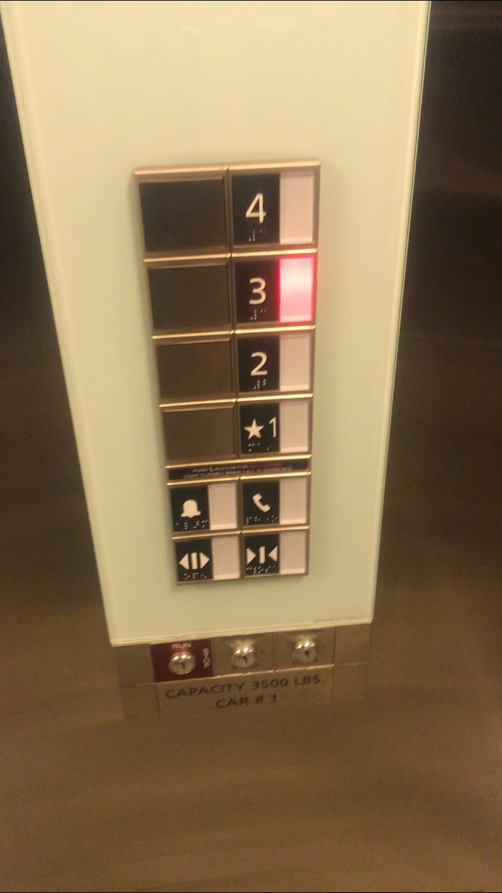
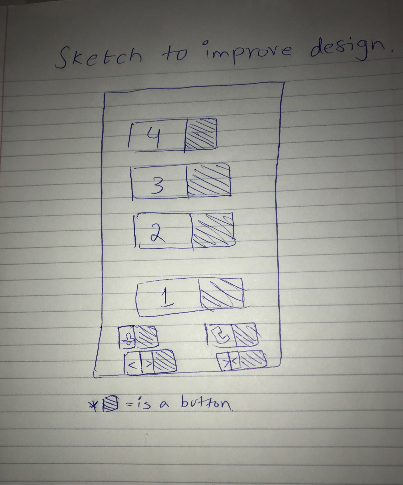

# abdussamiyakoob.github.io

The Elevator I have chosen today is in Park East – Student Living

  

Three issues with the current design:

1. No up and down arrows mentioned
2. Open - Close door button too close
3. No emergency manual key lock for emergency purposes

Features that are really useful and helpful in this design:
1. Facilitates the disable like blind by announcing the floors or going up/down
2. Floors lined up vertically from top to bottom which is a friendly user interface
3. Numbers printed side by side with the buttons to avoid confusion

Improvement in the design:

